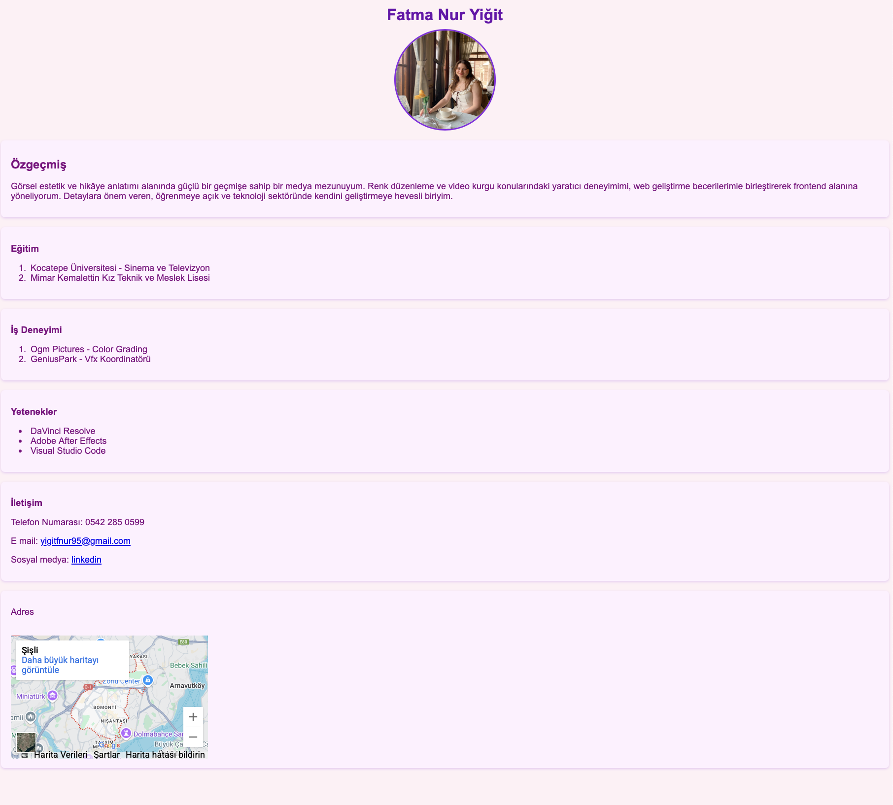

# Ödev 1 - İlk Web Sayfamız

Bu ödevde HTML5 kullanarak kendimizi tanıtan basit bir web sayfası oluşturduk.

## İçerik

- Ana başlık ve alt başlıklarla CV bölümleri (Özgeçmiş, Eğitim, İş Deneyimi, Yetenekler, İletişim)
- Paragraflar ve listeler (sıralı ve sırasız)
- Bir adet fotoğraf ve sosyal medya bağlantıları
- Google Maps iframe ile konum gösterimi
- Basit CSS ile renkler ve yazı stilleri

---

## Proje Görseli

